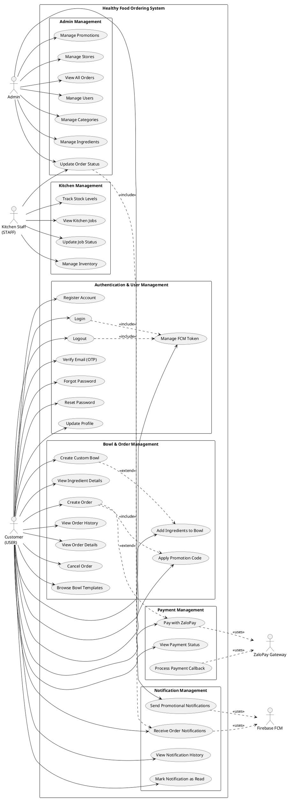

# Use Case Diagram - Healthy Food Ordering System

## PlantUML Code

## Use Case Descriptions

### Customer Use Cases

1. **Register Account (UC1)**: Customer creates a new account with email and password
2. **Login (UC2)**: Customer logs in with email and password
3. **Logout (UC3)**: Customer logs out and removes FCM token
4. **Verify Email (UC4)**: Customer verifies email with 6-digit OTP
5. **Forgot Password (UC5)**: Customer requests password reset OTP via email
6. **Reset Password (UC6)**: Customer resets password using OTP
7. **Update Profile (UC7)**: Customer updates personal information
8. **Manage FCM Token (UC8)**: System saves/removes FCM token for push notifications
9. **Browse Bowl Templates (UC9)**: Customer views available bowl templates
10. **Create Custom Bowl (UC10)**: Customer creates a custom bowl from template
11. **Add Ingredients to Bowl (UC11)**: Customer adds/removes ingredients
12. **View Ingredient Details (UC12)**: Customer views ingredient nutritional info
13. **Create Order (UC13)**: Customer places an order with bowls
14. **View Order History (UC14)**: Customer views past orders
15. **View Order Details (UC15)**: Customer views specific order details
16. **Cancel Order (UC16)**: Customer cancels a pending order
17. **Apply Promotion Code (UC17)**: Customer applies discount code to order
18. **Pay with ZaloPay (UC18)**: Customer pays using ZaloPay gateway
19. **View Payment Status (UC19)**: Customer checks payment transaction status
20. **Receive Order Notifications (UC21)**: Customer receives push notifications for order updates
21. **View Notification History (UC22)**: Customer views all notifications
22. **Mark Notification as Read (UC23)**: Customer marks notification as read

### Admin Use Cases

24. **Send Promotional Notifications (UC24)**: Admin sends promotional push notifications
25. **Manage Users (UC25)**: Admin creates/updates/deletes user accounts
26. **Manage Categories (UC26)**: Admin manages ingredient categories
27. **Manage Ingredients (UC27)**: Admin adds/updates ingredients and prices
28. **Manage Promotions (UC28)**: Admin creates/updates promotion codes
29. **Manage Stores (UC29)**: Admin manages store locations
30. **View All Orders (UC30)**: Admin views all orders in system
31. **Update Order Status (UC31)**: Admin/Staff updates order status (triggers notification)

### Kitchen Staff Use Cases

32. **View Kitchen Jobs (UC32)**: Staff views assigned preparation jobs
33. **Update Job Status (UC33)**: Staff updates job completion status
34. **Manage Inventory (UC34)**: Staff adds/removes ingredient stock
35. **Track Stock Levels (UC35)**: Staff monitors ingredient availability

## Actors Description

- **Customer (USER)**: End-user who orders food
- **Admin**: System administrator with full access
- **Kitchen Staff (STAFF)**: Restaurant staff managing orders and inventory
- **ZaloPay Gateway**: External payment processing system
- **Firebase FCM**: External push notification service

