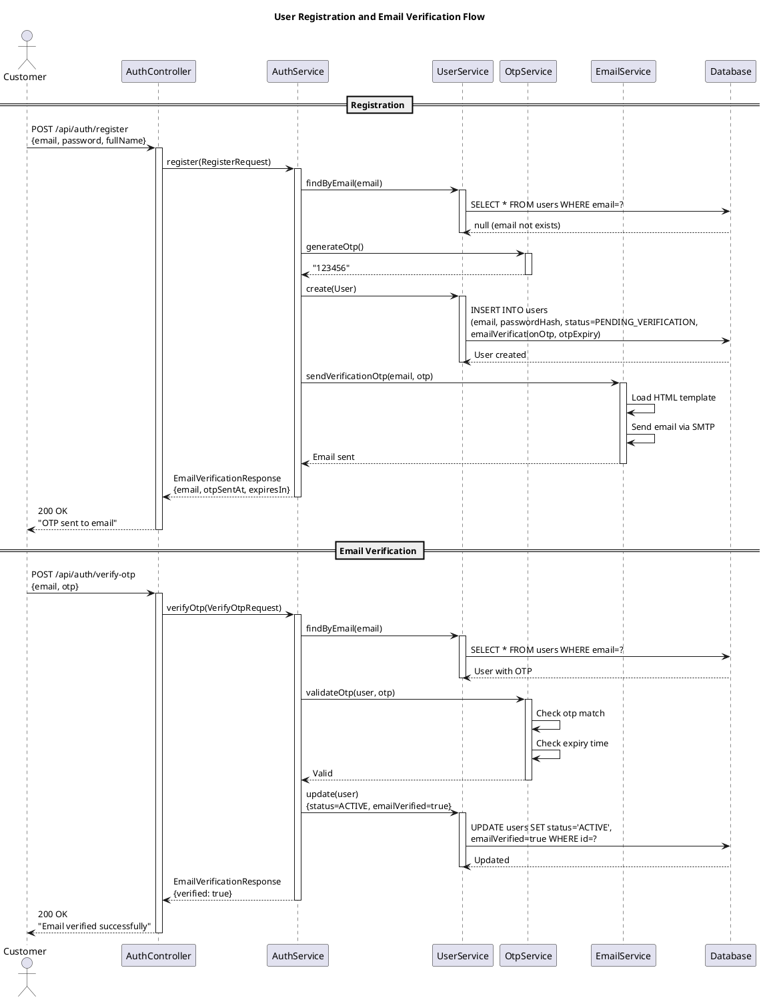
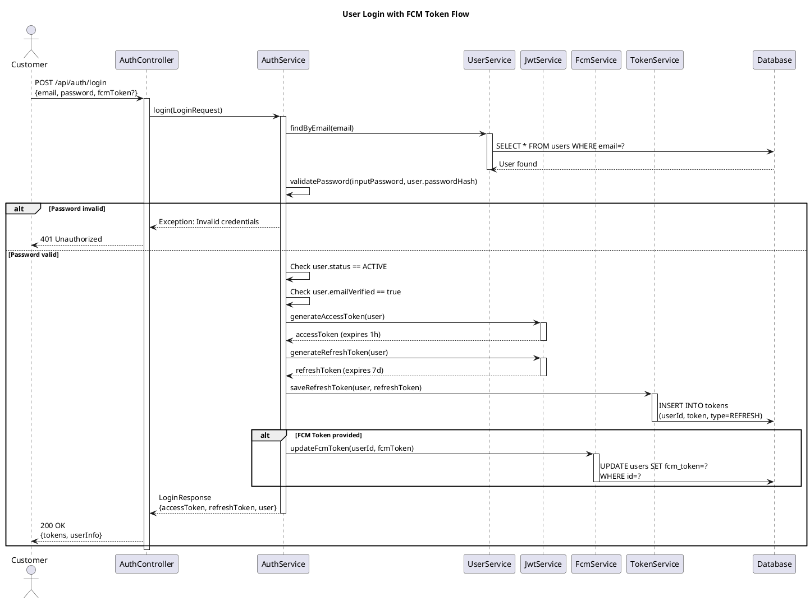
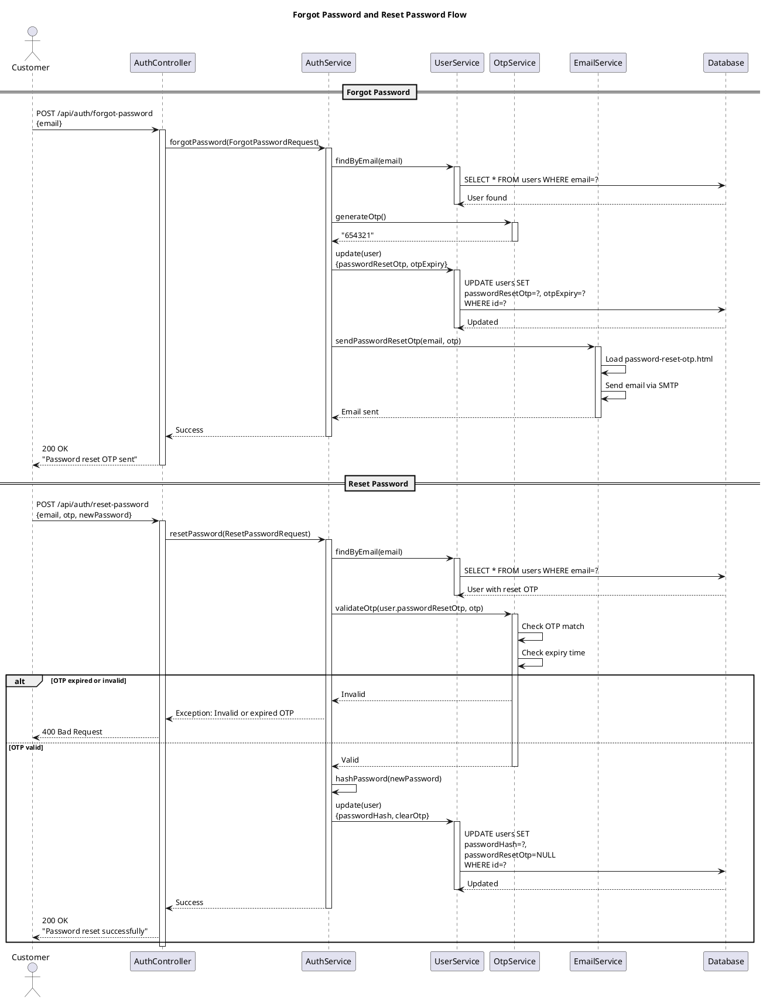
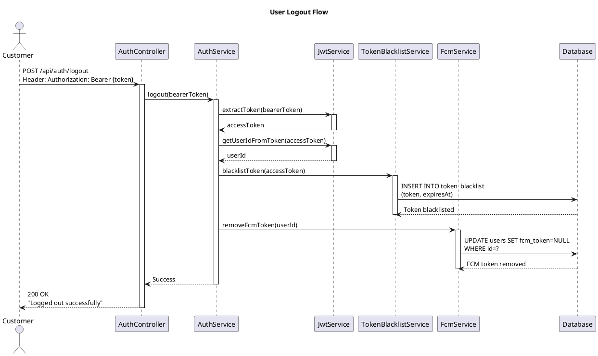
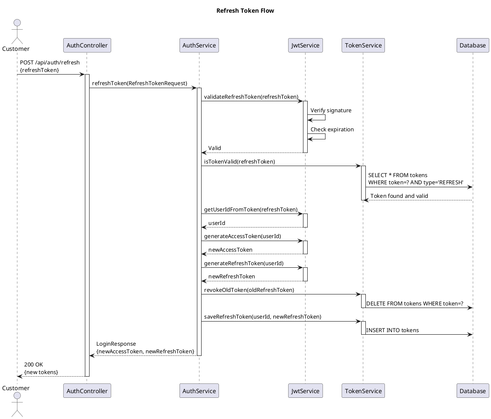

# Sequence Diagrams - Authentication Flows

## 1. User Registration and Email Verification

## 2. User Login with FCM Token

## 3. Forgot Password and Reset Password

## 4. Logout Flow

## 5. Refresh Token Flow

