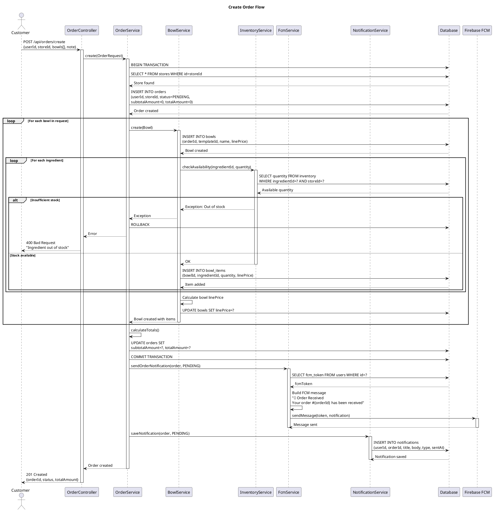
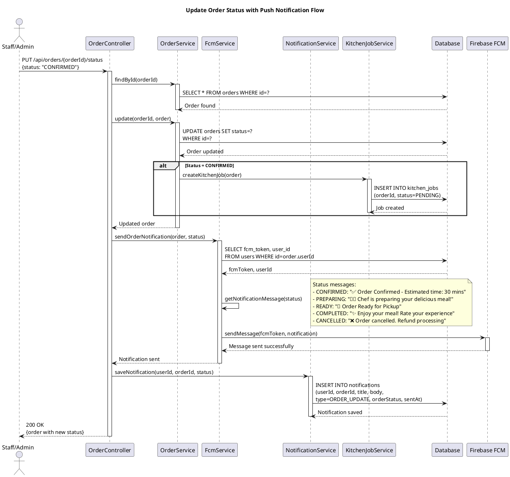
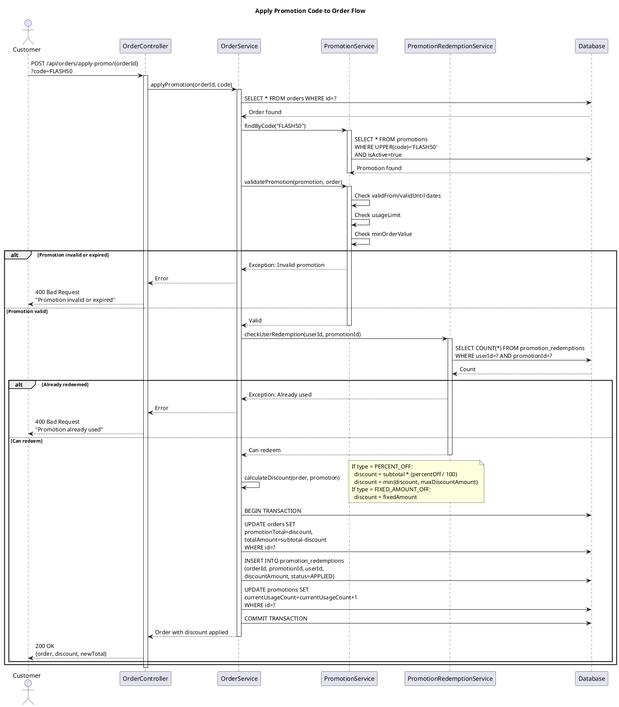
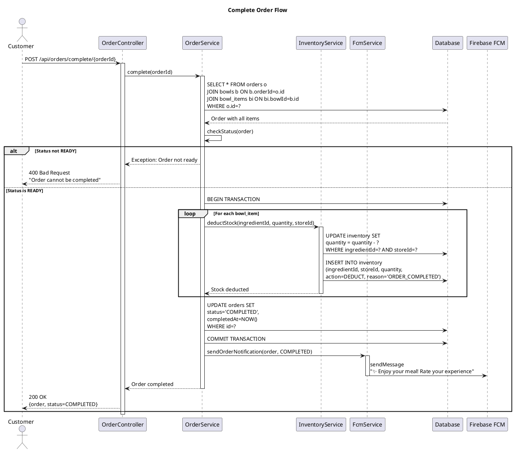
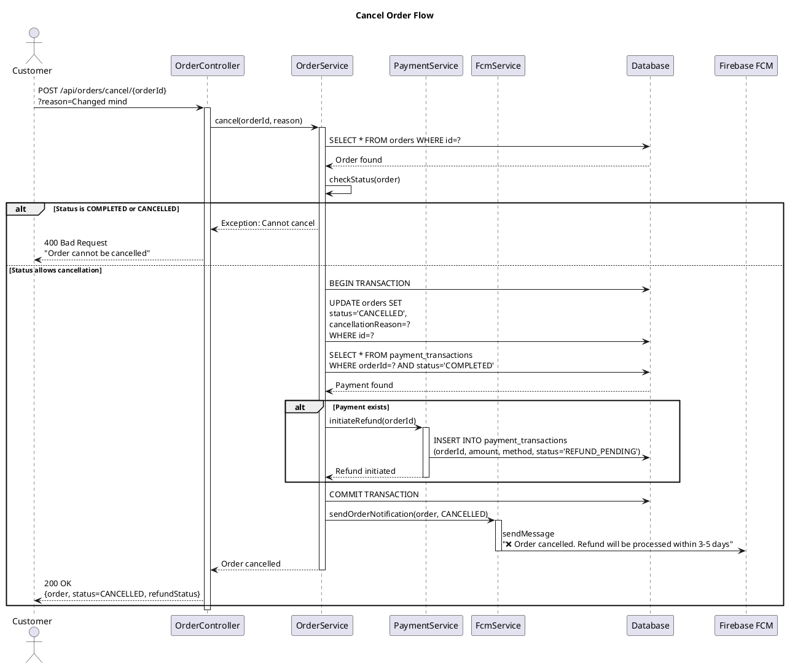
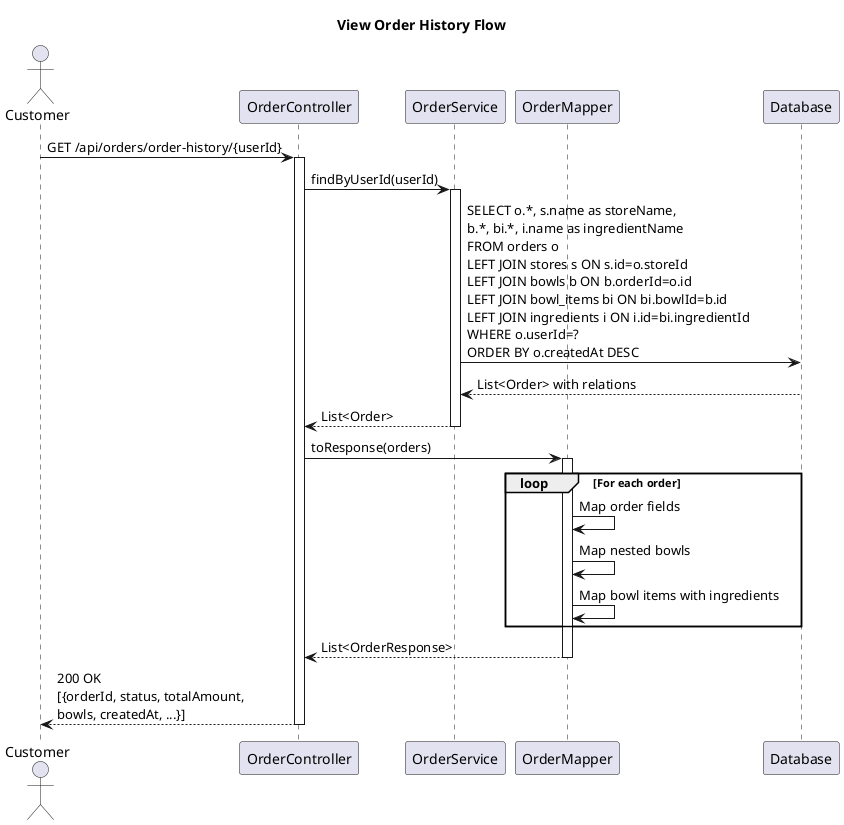

# Sequence Diagrams - Order Management Flows

## 1. Create Order Flow

## 2. Update Order Status Flow

## 3. Apply Promotion to Order Flow

## 4. Complete Order Flow

## 5. Cancel Order Flow

## 6. View Order History Flow

