# Sequence Diagrams - Payment & Notification Flows

## 1. ZaloPay Payment Flow

## 2. Push Notification Flow (FCM)

```plantuml
@startuml
title Push Notification Flow - Order Status Update

actor "Kitchen Staff" as Staff
participant "OrderController" as Controller
participant "OrderService" as OrderService
participant "FcmService" as FcmService
participant "NotificationService" as NotificationService
participant "Firebase Admin SDK" as FirebaseSDK
participant "Firebase FCM Server" as FCM
participant "Customer Mobile" as Mobile
participant "Database" as DB

== Order Status Update with Notification ==
Staff -> Controller: PUT /api/orders/{orderId}/status\n{status: "PREPARING"}
activate Controller

Controller -> OrderService: update(orderId, status)
activate OrderService
OrderService -> DB: UPDATE orders SET status='PREPARING'
DB --> OrderService: Order updated
deactivate OrderService

Controller -> FcmService: sendOrderNotification(order, PREPARING)
activate FcmService

' Get user's FCM token
FcmService -> DB: SELECT u.fcmToken, u.fullName\nFROM users u\nJOIN orders o ON o.userId=u.id\nWHERE o.id=?
DB --> FcmService: {fcmToken, fullName}

alt FCM Token not found
    FcmService --> Controller: Warning: No FCM token
    note right: Log warning but don't fail request
else FCM Token exists
    
    ' Build notification message
    FcmService -> FcmService: buildNotificationMessage(status)
    note right
      {
        token: user.fcmToken,
        notification: {
          title: "👨‍🍳 Order Update",
          body: "Chef is preparing your delicious meal!",
          image: storeImageUrl
        },
        data: {
          type: "order_update",
          orderId: "uuid",
          orderStatus: "PREPARING",
          click_action: "FLUTTER_NOTIFICATION_CLICK"
        },
        android: {
          priority: "high",
          notification: {
            channelId: "order_updates",
            color: "#52946B",
            sound: "default"
          }
        },
        apns: {
          payload: {
            aps: {
              sound: "default",
              badge: 1
            }
          }
        }
      }
    end note
    
    ' Send via Firebase
    FcmService -> FirebaseSDK: send(message)
    activate FirebaseSDK
    FirebaseSDK -> FCM: POST /v1/projects/.../messages:send
    activate FCM
    
    FCM -> Mobile: Push notification
    activate Mobile
    
    alt App in Foreground
        Mobile -> Mobile: onMessage() - Show local notification
    else App in Background
        Mobile -> Mobile: onBackgroundMessage() - System notification
    else App Terminated
        Mobile -> Mobile: System shows notification in tray
    end
    
    FCM --> FirebaseSDK: {name: "projects/.../messages/0:..."}
    deactivate FCM
    FirebaseSDK --> FcmService: Message ID
    deactivate FirebaseSDK
    
    deactivate Mobile
    
    ' Save notification to history
    FcmService -> NotificationService: saveNotification(notification)
    activate NotificationService
    NotificationService -> DB: INSERT INTO notifications\n(userId, orderId, title, body,\ntype=ORDER_UPDATE, orderStatus,\nsentAt=NOW())
    DB --> NotificationService: Notification saved
    deactivate NotificationService
    
    FcmService --> Controller: Notification sent successfully
end
deactivate FcmService

Controller --> Staff: 200 OK\n{order updated}
deactivate Controller

== User Opens Notification ==
Customer -> Mobile: Tap notification
Mobile -> Mobile: getInitialMessage() or onMessageOpenedApp()
Mobile -> Mobile: Navigate to OrderDetailScreen(orderId)
Mobile --> Customer: Show order details

@enduml
```

## 3. Promotional Notification Flow

## 4. View Notification History Flow

## 5. FCM Token Management Flow

