# Activity Diagrams - Business Process Flows (Simplified & Enhanced)

## 1. User Registration and Email Verification


## 2. Create Order Process


## 3. Order Status Management

```plantuml
@startuml
skinparam backgroundColor #FEFEFE
skinparam activityBackgroundColor<< Pending >> #FFF4E6
skinparam activityBackgroundColor<< Confirmed >> #E3F2FD
skinparam activityBackgroundColor<< Preparing >> #FFF9C4
skinparam activityBackgroundColor<< Ready >> #C8E6C9
skinparam activityBackgroundColor<< Completed >> #A5D6A7

title Order Lifecycle Management

|Customer|
start
:Create order;

|System|
:Set status = PENDING<< Pending >>;
:Send "Order Received" notification;

|Admin/Staff|
:Review order;

if (Accept order?) then (no)
  |System|
  :Set status = CANCELLED;
  :Send cancellation notification;
  stop
endif

|System|
:Set status = CONFIRMED<< Confirmed >>;
:Create kitchen job;
:Send "Order Confirmed ✅" notification;

|Kitchen Staff|
:Start food preparation;

|System|
:Set status = PREPARING<< Preparing >>;
:Send "Chef is preparing 👨‍🍳" notification;

|Kitchen Staff|
:Complete preparation;
:Mark job as completed;

|System|
:Set status = READY<< Ready >>;
:Send "Ready for pickup 🎉" notification;

|Customer|
:Arrive at store;
:Pick up order;

|Staff|
:Confirm customer pickup;

|System|
:Set status = COMPLETED<< Completed >>;
:Deduct inventory stock;
:Send "Enjoy your meal! ✨" notification;

stop

@enduml
```



## 4. ZaloPay Payment Processing


---

## Notes

**Key Features:**
- ✅ Simplified flow with clear decision points
- 🎨 Color-coded status indicators
- 📱 Push notification integration
- 🔒 Payment security with MAC signature verification
- 📊 Inventory management integration
- 🍜 Kitchen job workflow

**API Endpoints:**
- `POST /api/auth/register` - User registration
- `POST /api/auth/verify-otp` - Email verification
- `POST /api/orders/create` - Create order
- `POST /api/orders/confirm/{id}` - Confirm order
- `POST /api/orders/complete/{id}` - Complete order
- `POST /api/zalopay/create-payment` - Initiate payment
- `POST /api/zalopay/callback` - Payment callback

---

## Additional Diagrams (Optional Reference)

### 5. Apply Promotion Code Activity


## 6. Kitchen Job Management Activity


## 7. Inventory Management Activity

```plantuml
@startuml
title Inventory Management Activity Diagram

|Kitchen Staff|
start

if (Action type?) then (Add Stock)
  :Receive ingredient delivery;
  
  :Scan/Enter ingredient barcode;
  
  :Enter quantity to add;
  
  :Enter expiry date (if applicable);
  
  |System|
  :Validate ingredient exists;
  
  :Start transaction;
  
  :Update inventory\nquantity = quantity + added;
  
  :Create inventory log\n(action=ADD, quantity, reason);
  
  :Commit transaction;
  
  :Return success;
  
  |Kitchen Staff|
  :View updated stock level;
  
  stop
  
else (Deduct Stock)
  :Order completed;
  
  |System|
  :Fetch order bowl items;
  
  repeat :For each ingredient used;
    :Calculate total quantity;
    
    :Start transaction;
    
    :Check current stock level;
    
    if (Stock sufficient?) then (no)
      :Rollback transaction;
      
      :Log inventory error;
      
      :Send alert to manager;
      
      stop
    else (yes)
      :Update inventory\nquantity = quantity - used;
      
      :Create inventory log\n(action=DEDUCT, quantity,\nreason=ORDER_COMPLETED);
      
      if (Stock below threshold?) then (yes)
        :Trigger low stock alert;
        
        :Create purchase order suggestion;
      endif
    endif
  repeat while (More ingredients?)
  
  :Commit transaction;
  
  stop
  
else (Check Stock)
  |Kitchen Staff|
  :Navigate to inventory page;
  
  |System|
  :Fetch all inventory items;
  
  :Calculate stock levels;
  
  partition "Display Information" {
    :Show ingredient name;
    :Show current quantity;
    :Show unit of measure;
    :Show last updated time;
    
    if (Stock level low?) then (yes)
      :Highlight in red;
    else if (Stock level medium?) then (yes)
      :Highlight in yellow;
    else (sufficient)
      :Highlight in green;
    endif
  }
  
  |Kitchen Staff|
  :Review stock status;
  
  if (Need to reorder?) then (yes)
    :Create purchase order;
    
    :Submit to supplier;
  endif
  
  stop
  
else (Adjust Stock)
  |Kitchen Staff|
  :Physical inventory count;
  
  :Enter actual quantity;
  
  :Enter adjustment reason;
  
  |System|
  :Calculate difference;
  
  :difference = actual - system;
  
  if (Large discrepancy?) then (yes)
    :Require manager approval;
    
    |Manager|
    :Review adjustment;
    
    if (Approve?) then (no)
      :Reject adjustment;
      
      :Request recount;
      
      stop
    endif
  endif
  
  :Update inventory quantity;
  
  :Create inventory log\n(action=ADJUST, difference, reason);
  
  stop
endif

@enduml
```


