# Activity Diagrams - Business Process Flows (Simplified)

## 1. User Registration and Email Verification


---

## 2. Create Order Process


---

## 3. Order Status Management

```plantuml
@startuml
skinparam backgroundColor #FEFEFE
skinparam activityBackgroundColor<< Pending >> #FFF4E6
skinparam activityBackgroundColor<< Confirmed >> #E3F2FD
skinparam activityBackgroundColor<< Preparing >> #FFF9C4
skinparam activityBackgroundColor<< Ready >> #C8E6C9
skinparam activityBackgroundColor<< Completed >> #A5D6A7

title Order Lifecycle Management

|Customer|
start
:Create order;

|System|
:Set status = PENDING<< Pending >>;
:Send "Order Received" notification;

|Admin/Staff|
:Review order;

if (Accept order?) then (no)
  |System|
  :Set status = CANCELLED;
  :Send cancellation notification;
  stop
endif

|System|
:Set status = CONFIRMED<< Confirmed >>;
:Create kitchen job;
:Send "Order Confirmed ✅" notification;

|Kitchen Staff|
:Start food preparation;

|System|
:Set status = PREPARING<< Preparing >>;
:Send "Chef is preparing 👨‍🍳" notification;

|Kitchen Staff|
:Complete preparation;
:Mark job as completed;

|System|
:Set status = READY<< Ready >>;
:Send "Ready for pickup 🎉" notification;

|Customer|
:Arrive at store;
:Pick up order;

|Staff|
:Confirm customer pickup;

|System|
:Set status = COMPLETED<< Completed >>;
:Deduct inventory stock;
:Send "Enjoy your meal! ✨" notification;

stop

@enduml
```



---

## 4. ZaloPay Payment Processing


---

## Notes

**Key Features:**
- ✅ Simplified flow with clear decision points
- 🎨 Color-coded status indicators
- 📱 Push notification integration
- 🔒 Payment security with MAC signature verification
- 📊 Inventory management integration
- 🍜 Kitchen job workflow

**API Endpoints:**
- `POST /api/auth/register` - User registration
- `POST /api/auth/verify-otp` - Email verification
- `POST /api/orders/create` - Create order
- `POST /api/orders/confirm/{id}` - Confirm order
- `POST /api/orders/complete/{id}` - Complete order
- `POST /api/zalopay/create-payment` - Initiate payment
- `POST /api/zalopay/callback` - Payment callback

---

## 5. Apply Promotion to Order

```plantuml
@startuml
skinparam backgroundColor #FEFEFE
skinparam activity {
  BackgroundColor<< Success >> #C8E6C9
  BackgroundColor<< Error >> #FFCDD2
  BackgroundColor<< Processing >> #BBDEFB
  BorderColor DarkSlateGray
  FontName Arial
}

title Apply Promotion Code to Order

|Customer|
start
:View order details;
:Enter promotion code;
:Submit code;
note right: POST /api/orders/apply-promo/{orderId}?code=XXX

|System|
:Validate order exists;

if (Order found?) then (no)
  :Return "Order not found"<< Error >>;
  stop
endif

if (Order status = PENDING?) then (no)
  :Return "Can only apply to PENDING orders"<< Error >>;
  stop
endif

:Search promotion by code;

if (Promotion exists?) then (no)
  :Return "Invalid promotion code"<< Error >>;
  stop
endif

:Validate promotion;

if (Promotion active?) then (no)
  :Return "Promotion inactive"<< Error >>;
  stop
endif

if (Current date within starts_at & ends_at?) then (no)
  :Return "Promotion expired"<< Error >>;
  stop
endif

:Check if promotion already applied;

if (Already applied?) then (yes)
  :Return "Promotion already applied"<< Error >>;
  stop
endif

:Calculate discount amount
= subtotal × discount_percent / 100;
:Update order.promotionTotal;
:Update order.totalAmount
= subtotal - discount;
:Create promotion_redemption
status = APPLIED<< Processing >>;
:Save to database;

fork
  :Send notification
  "🎉 Promotion applied!"<< Success >>;
fork again
  :Log promotion usage;
end fork

|Customer|
:See updated order total
with discount applied<< Success >>;
stop

@enduml
```



---

## 6. Ingredient Inventory Management

```plantuml
@startuml
skinparam backgroundColor #FEFEFE
skinparam activity {
  BackgroundColor<< Success >> #C8E6C9
  BackgroundColor<< Warning >> #FFF9C4
  BackgroundColor<< Error >> #FFCDD2
  BorderColor DarkSlateGray
  FontName Arial
}

title Ingredient Inventory Update Process

|Admin/Staff|
start
:Access inventory management;
:Select ingredient to update;
note right: PUT /api/ingredients/update/{id}

|System|
:Load ingredient details;
:Display current stock level;

|Admin/Staff|
:Review current quantity;

if (Stock update type?) then (Add Stock)
  :Enter quantity to add;
  note right: Receiving new supplies
  
  |System|
  :Add to current stock;
  :Update ingredient.quantity;
  :Log inventory transaction
  type = STOCK_IN;
  
else (Adjust Stock)
  :Enter new quantity;
  note right: Manual adjustment
  
  |System|
  :Replace current quantity;
  :Log inventory transaction
  type = ADJUSTMENT;
  
else (Deduct Stock)
  :Enter quantity to deduct;
  note right: Wastage or damage
  
  |System|
  :Subtract from current stock;
  
  if (Result < 0?) then (yes)
    :Return "Insufficient stock"<< Error >>;
    stop
  endif
  
  :Update ingredient.quantity;
  :Log inventory transaction
  type = STOCK_OUT;
endif

:Calculate new stock level;

if (Stock < minimum threshold?) then (yes)
  :Set low stock alert<< Warning >>;
  fork
    :Send notification to admin
    "⚠️ Low stock alert";
  fork again
    :Add to replenishment list;
  end fork
endif

:Save changes to database;

|Admin/Staff|
:View updated inventory<< Success >>;
:Generate stock report;
stop

@enduml
```

---

## 7. Bowl Template Creation with Default Ingredients


---

## 8. AI Bowl Analysis for Nutritional Goals


---

## 9. User Password Reset Flow


---

## Additional Notes

**New Diagrams Cover:**
1. **Promotion Application** - Discount code validation and redemption
2. **Inventory Management** - Stock updates with low-stock alerts
3. **Template Creation** - Bowl template with default ingredients setup
4. **AI Bowl Analysis** - Integration with OpenAI for nutritional recommendations
5. **Password Reset** - Secure OTP-based password recovery

**Key Patterns:**
- 🏊 **Swimlanes** clearly show responsibility separation
- ✅ **Validation gates** at each critical step
- 🔔 **Async notifications** with fork/join
- 🔒 **Security checks** (OTP limits, authentication)
- 📊 **Business logic** (calculations, stock checks)
- 🎨 **Color coding** for different states

**Related API Endpoints:**
- `POST /api/orders/apply-promo/{orderId}` - Apply promotion
- `PUT /api/ingredients/update/{id}` - Update inventory
- `POST /api/bowl_templates/create` - Create template
- `POST /api/default_ingredients/create-bulk` - Add defaults
- `POST /api/ai/analyze-bowl` - AI analysis
- `POST /api/auth/forgot-password` - Request reset
- `POST /api/auth/reset-password` - Complete reset

