# Activity Diagrams - Business Process Flows (Simplified)

## 1. User Registration and Email Verification

---

## 2. Create Order Process

---

## 3. Order Status Management

```plantuml
@startuml
skinparam backgroundColor #FEFEFE
skinparam activityBackgroundColor<< Pending >> #FFF4E6
skinparam activityBackgroundColor<< Confirmed >> #E3F2FD
skinparam activityBackgroundColor<< Preparing >> #FFF9C4
skinparam activityBackgroundColor<< Ready >> #C8E6C9
skinparam activityBackgroundColor<< Completed >> #A5D6A7

title Order Lifecycle Management

|Customer|
start
:Create order;

|System|
:Set status = PENDING<< Pending >>;
:Send "Order Received" notification;

|Admin/Staff|
:Review order;

if (Accept order?) then (no)
  |System|
  :Set status = CANCELLED;
  :Send cancellation notification;
  stop
endif

|System|
:Set status = CONFIRMED<< Confirmed >>;
:Create kitchen job;
:Send "Order Confirmed ✅" notification;

|Kitchen Staff|
:Start food preparation;

|System|
:Set status = PREPARING<< Preparing >>;
:Send "Chef is preparing 👨‍🍳" notification;

|Kitchen Staff|
:Complete preparation;
:Mark job as completed;

|System|
:Set status = READY<< Ready >>;
:Send "Ready for pickup 🎉" notification;

|Customer|
:Arrive at store;
:Pick up order;

|Staff|
:Confirm customer pickup;

|System|
:Set status = COMPLETED<< Completed >>;
:Deduct inventory stock;
:Send "Enjoy your meal! ✨" notification;

stop

@enduml
```

---

## 4. ZaloPay Payment Processing

---

## Notes

**Key Features:**
- ✅ Simplified flow with clear decision points
- 🎨 Color-coded status indicators
- 📱 Push notification integration
- 🔒 Payment security with MAC signature verification
- 📊 Inventory management integration
- 🍜 Kitchen job workflow

**API Endpoints:**
- `POST /api/auth/register` - User registration
- `POST /api/auth/verify-otp` - Email verification
- `POST /api/orders/create` - Create order
- `POST /api/orders/confirm/{id}` - Confirm order
- `POST /api/orders/complete/{id}` - Complete order
- `POST /api/zalopay/create-payment` - Initiate payment
- `POST /api/zalopay/callback` - Payment callback

