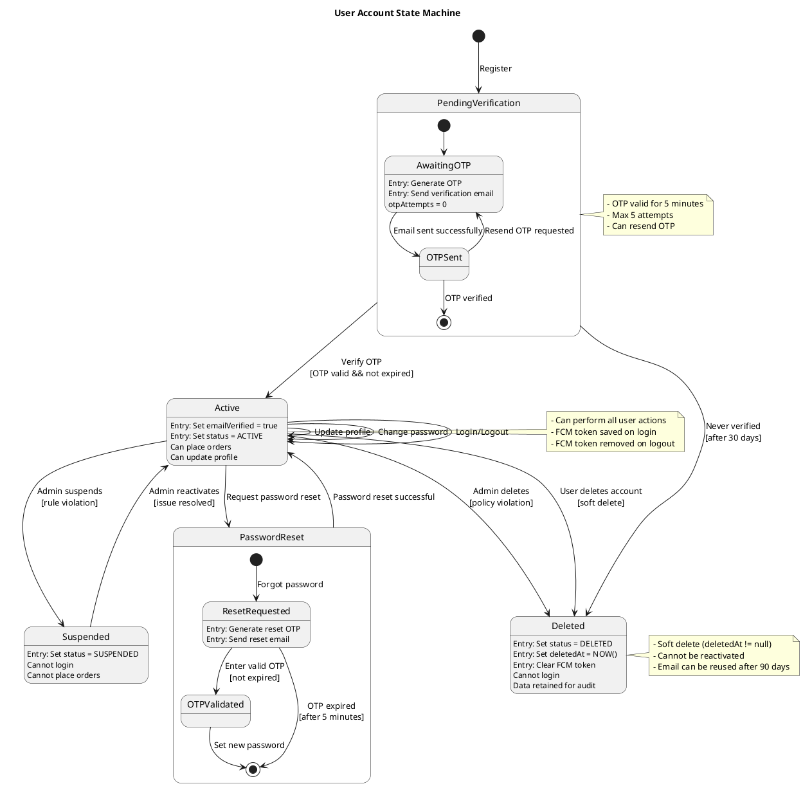
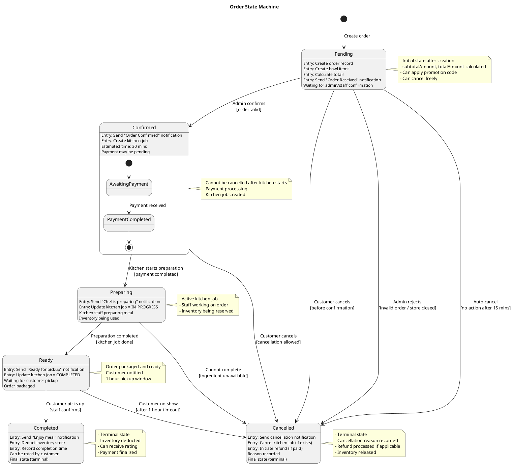
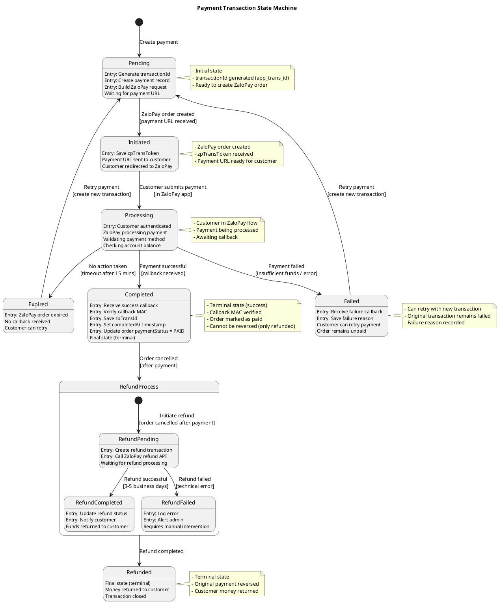
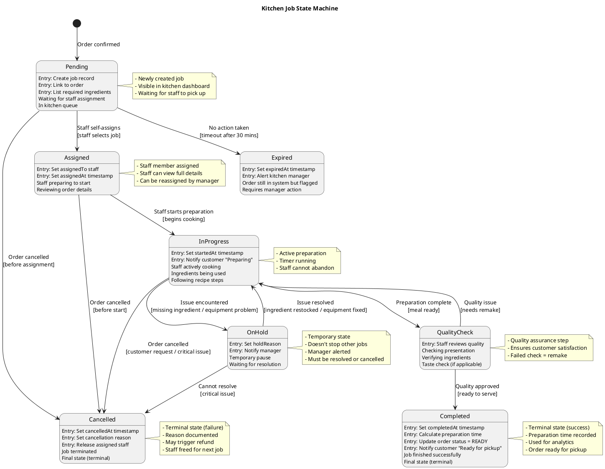
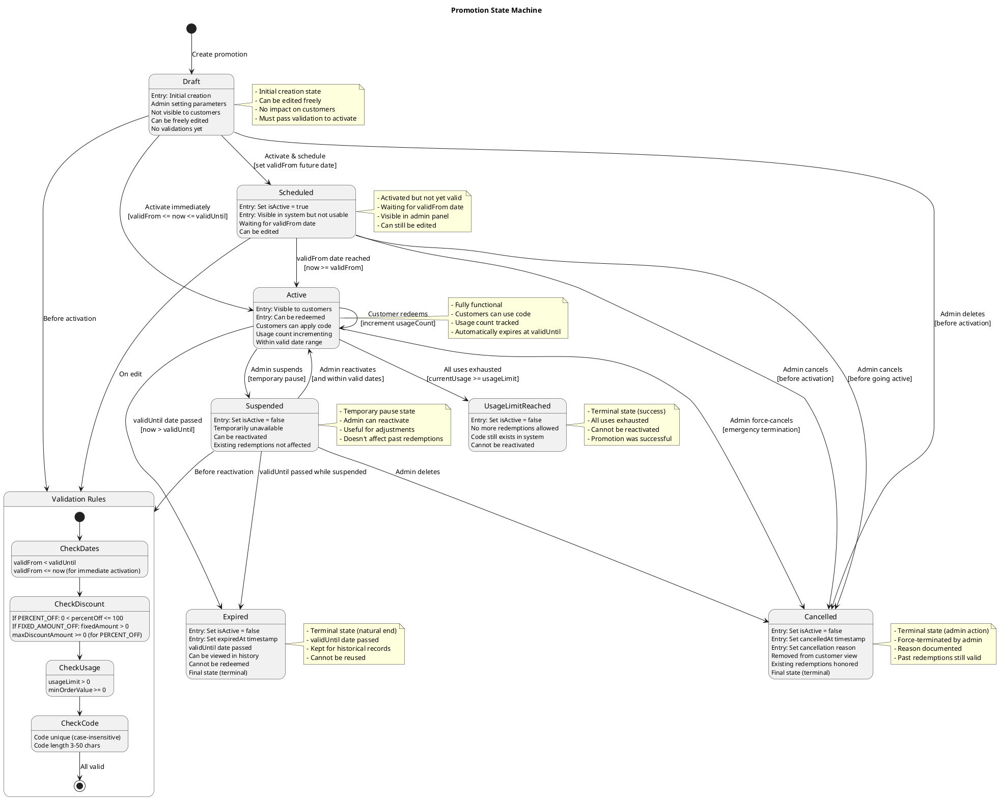
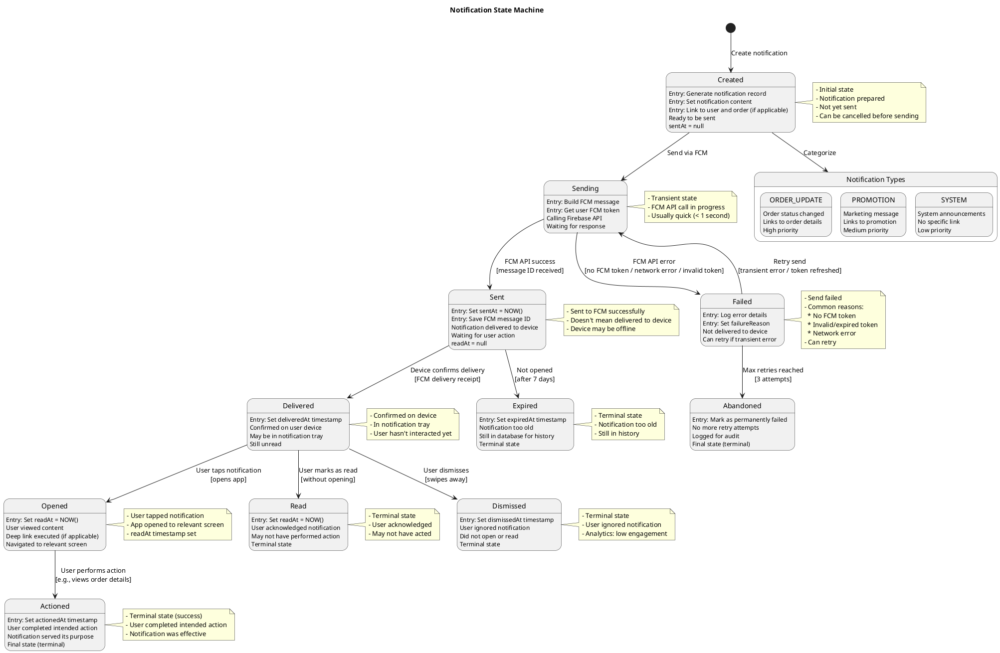

# State Diagrams - Main Objects

## 1. User Account State Diagram

## 2. Order State Diagram

## 3. Payment Transaction State Diagram

## 4. Kitchen Job State Diagram

## 5. Promotion State Diagram

## 6. Notification State Diagram

