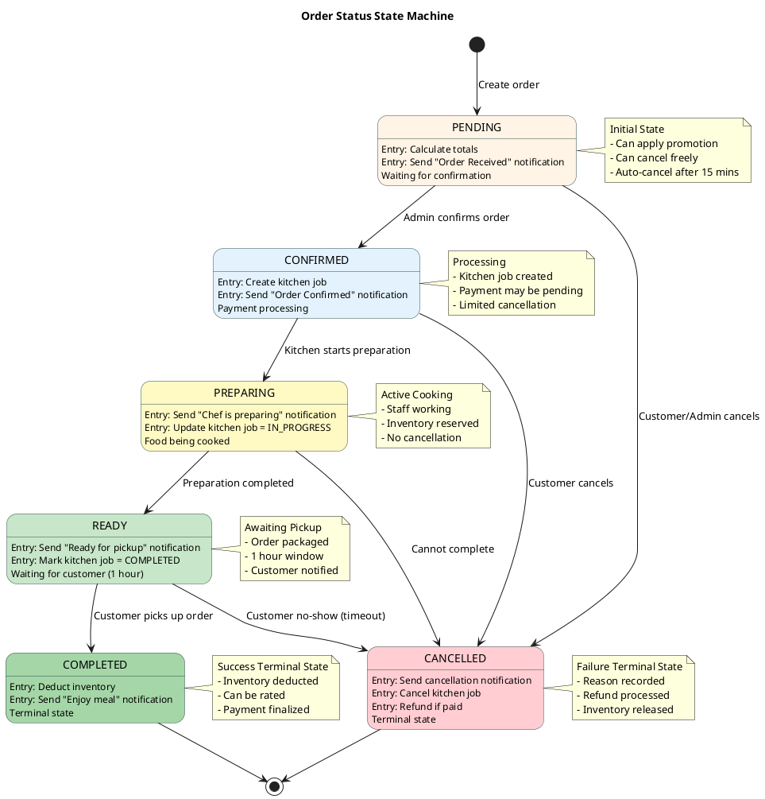

# State Diagrams - Main Objects (Simplified & Enhanced)

## 1. Order State Machine (Primary Focus)



## 2. Payment Transaction State Machine (ZaloPay Integration)

```plantuml
@startuml
skinparam state {
  BackgroundColor<< Pending >> #FFF4E6
  BackgroundColor<< Initiated >> #E3F2FD
  BackgroundColor<< Processing >> #BBDEFB
  BackgroundColor<< Completed >> #C8E6C9
  BackgroundColor<< Failed >> #FFCDD2
  BackgroundColor<< Refunded >> #F0F0F0
  BackgroundColor #FFFFFF
  BorderColor DarkSlateGray
  FontName Arial
}

title Payment Transaction State Machine

[*] --> PENDING : Create payment

PENDING<< Pending >> : Entry: Generate transactionId
PENDING : Entry: Build ZaloPay request
PENDING : Waiting for payment URL

PENDING --> INITIATED : ZaloPay order created\n(payment URL received)

INITIATED<< Initiated >> : Entry: Save zpTransToken
INITIATED : Entry: Send payment URL to customer
INITIATED : Customer redirected to ZaloPay

INITIATED --> PROCESSING : Customer submits payment
INITIATED --> EXPIRED : Timeout (15 minutes)

PROCESSING<< Processing >> : Customer authenticated
PROCESSING : ZaloPay validating payment
PROCESSING : Checking account balance

PROCESSING --> COMPLETED : Payment successful\n(callback received)
PROCESSING --> FAILED : Payment failed\n(insufficient funds)

COMPLETED<< Completed >> : Entry: Verify callback MAC
COMPLETED : Entry: Save zpTransId
COMPLETED : Entry: Update order paymentStatus = PAID
COMPLETED : Terminal state (success)

FAILED<< Failed >> : Entry: Save failure reason
FAILED : Customer can retry
FAILED : Order remains unpaid

FAILED --> PENDING : Create new transaction\n(retry payment)

EXPIRED<< Failed >> : Entry: ZaloPay order expired
EXPIRED : No callback received

EXPIRED --> PENDING : Create new transaction\n(retry payment)

state "Refund Process" as REFUND {
  [*] --> RefundPending
  
  RefundPending : Call ZaloPay refund API
  RefundPending : Waiting 3-5 business days
  
  RefundPending --> RefundCompleted : Refund successful
  RefundPending --> RefundFailed : Refund failed
  
  RefundCompleted : Funds returned
  RefundCompleted : Customer notified
  
  RefundFailed : Alert admin
  RefundFailed : Manual intervention
  
  RefundCompleted --> [*]
  RefundFailed --> [*]
}

COMPLETED --> REFUND : Order cancelled\n(after payment)

REFUND --> REFUNDED : Refund completed

REFUNDED<< Refunded >> : Entry: Update refund status
REFUNDED : Money returned to customer
REFUNDED : Transaction closed

COMPLETED --> [*]
REFUNDED --> [*]

note right of PENDING
  **Initial State**
  • transactionId format:
    YYMMDD_orderId
  • Ready for ZaloPay API
end note

note right of INITIATED
  **Payment URL Ready**
  • zpTransToken received
  • Valid for 15 minutes
end note

note right of PROCESSING
  **Payment In Progress**
  • Customer in ZaloPay
  • Awaiting callback
  • Cannot cancel
end note

note right of COMPLETED
  **Payment Success**
  • Callback MAC verified
  • Order marked as paid
  • Can only be refunded
end note

note bottom of FAILED
  **Payment Failed**
  • Failure reason saved
  • Can retry with new transaction
end note

note bottom of REFUNDED
  **Money Returned**
  • Refund completed
  • Transaction finalized
  • Terminal state
end note

@enduml
```

---

## State Transition Rules

### Order State Transitions

| From State | To State | Trigger | API Endpoint |
|------------|----------|---------|--------------|
| PENDING | CONFIRMED | Admin confirms | `POST /api/orders/confirm/{id}` |
| PENDING | CANCELLED | User/Admin cancels | `POST /api/orders/cancel/{id}` |
| CONFIRMED | PREPARING | Kitchen starts | Internal system |
| PREPARING | READY | Preparation done | Internal system |
| READY | COMPLETED | Customer pickup | `POST /api/orders/complete/{id}` |
| Any State | CANCELLED | Special conditions | `POST /api/orders/cancel/{id}` |

### Payment State Transitions

| From State | To State | Trigger | API Endpoint |
|------------|----------|---------|--------------|
| PENDING | INITIATED | ZaloPay response | `POST /api/zalopay/create-payment` |
| INITIATED | PROCESSING | Customer action | External (ZaloPay) |
| PROCESSING | COMPLETED | ZaloPay callback | `POST /api/zalopay/callback` |
| PROCESSING | FAILED | ZaloPay callback | `POST /api/zalopay/callback` |
| COMPLETED | REFUND | Order cancelled | `POST /api/zalopay/refund` |

---

## Key Features

✅ **Clear State Transitions** - Well-defined triggers and conditions
🎨 **Color-Coded States** - Easy visual identification
🔔 **Notification Integration** - Automatic notifications on state change
🔒 **Security Validation** - MAC signature verification for payments
📊 **Audit Trail** - All state changes are logged
⏰ **Timeout Handling** - Auto-cancellation for expired states

---

## Additional State Diagrams (Optional Reference)

### 3. Payment Transaction State Diagram (Detailed Version - Legacy)


## 4. Kitchen Job State Diagram


## 5. Promotion State Diagram


## 6. Notification State Diagram


