# State Diagrams - Simplified

## 1. Order State Machine

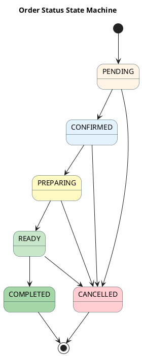

---

## 2. Payment Transaction State Machine

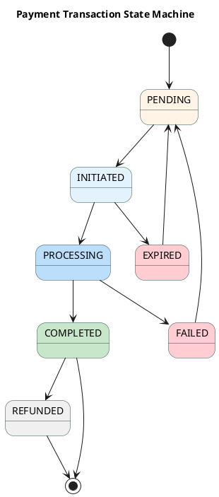

---

## 3. User Account State Machine

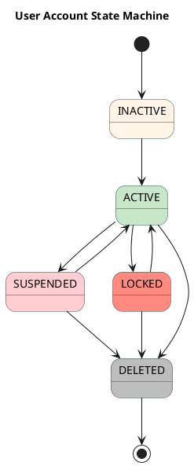

---

## 4. Ingredient Stock State Machine

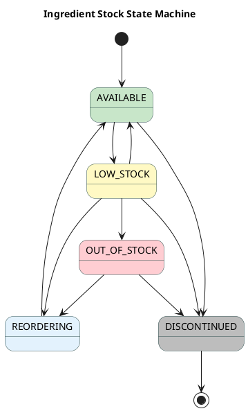

---

## 5. Promotion State Machine

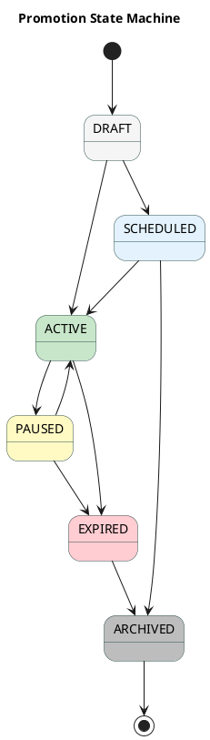

---

## 6. Bowl Customization State Machine

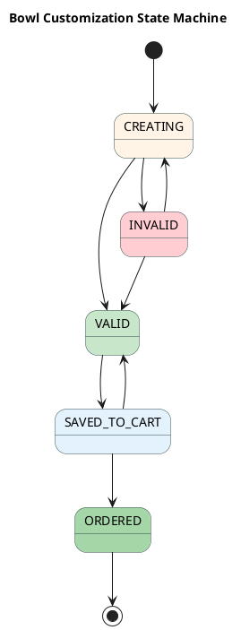

---

## 7. Notification Delivery State Machine

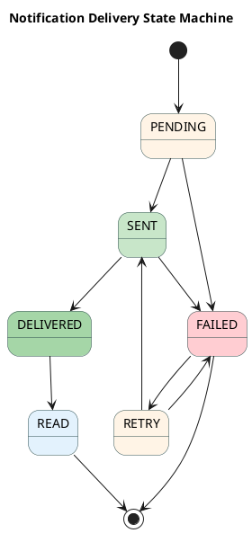

---

## 8. Bowl Template State Machine

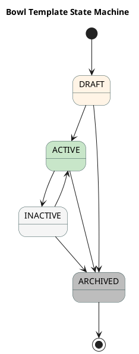

---

## 9. OTP Verification State Machine

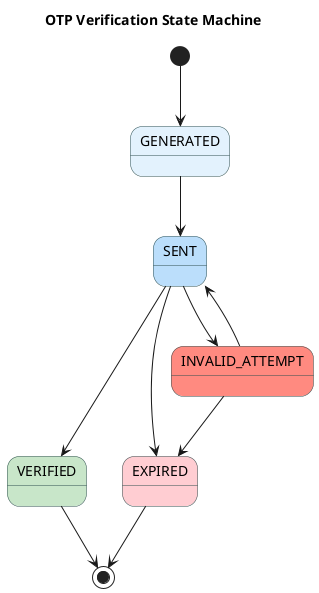

---

## 10. Ingredient Category State Machine

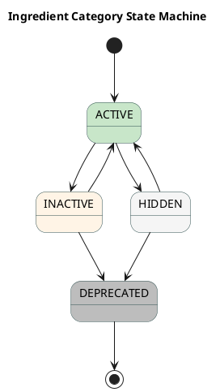

---

## 11. Promotion Redemption State Machine

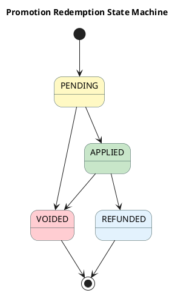

---

## 12. AI Bowl Analysis State Machine

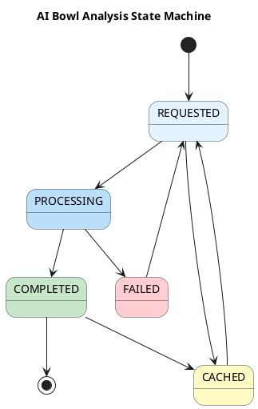

---

## State Transition Summary

All state diagrams follow a simplified approach without transition labels for cleaner visualization. Each state machine represents the possible states and transitions for different entities in the Healthy Food Ordering System.

**Diagrams included:**
1. Order Status - Complete order lifecycle
2. Payment Transaction - Payment processing flow
3. User Account - Account status management
4. Ingredient Stock - Inventory tracking
5. Promotion - Marketing campaign lifecycle
6. Bowl Customization - Bowl building process
7. Notification Delivery - Push notification states
8. Bowl Template - Template management lifecycle
9. OTP Verification - Email/SMS verification flow
10. Ingredient Category - Category management
11. Promotion Redemption - Promotion usage tracking
12. AI Bowl Analysis - AI analysis request flow

