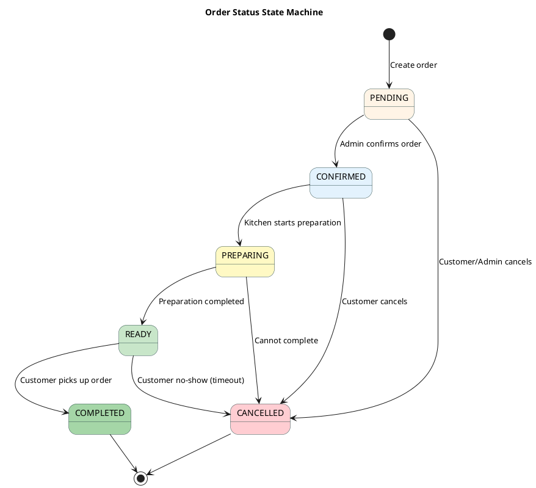
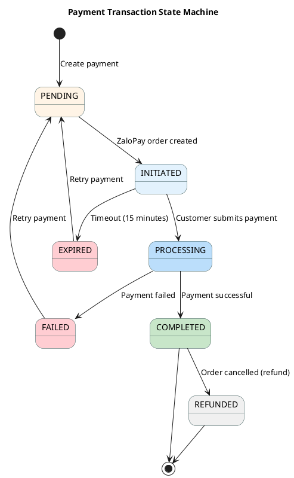

# State Diagrams - Simplified

## 1. Order State Machine

---

## 2. Payment Transaction State Machine

---

## State Transition Rules

### Order State Transitions

| From State | To State | Trigger |
|------------|----------|---------|
| PENDING | CONFIRMED | Admin confirms |
| PENDING | CANCELLED | User/Admin cancels |
| CONFIRMED | PREPARING | Kitchen starts |
| PREPARING | READY | Preparation done |
| READY | COMPLETED | Customer pickup |
| Any State | CANCELLED | Special conditions |

### Payment State Transitions

| From State | To State | Trigger |
|------------|----------|---------|
| PENDING | INITIATED | ZaloPay order created |
| INITIATED | PROCESSING | Customer submits payment |
| PROCESSING | COMPLETED | Payment successful |
| PROCESSING | FAILED | Payment failed |
| COMPLETED | REFUNDED | Order cancelled (refund) |

