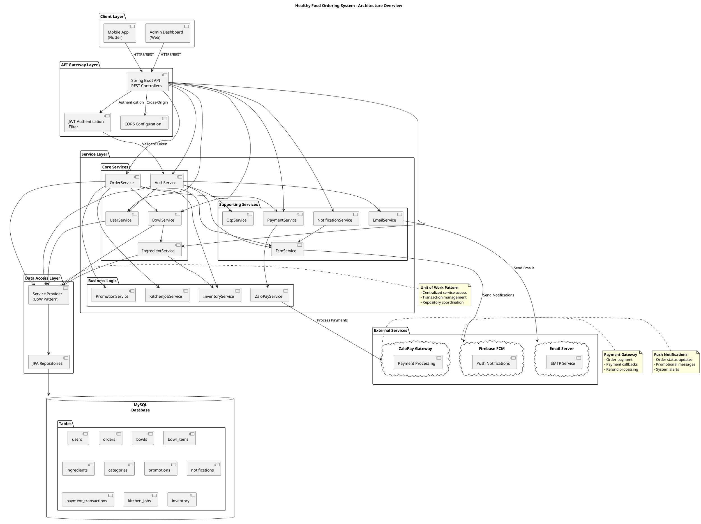
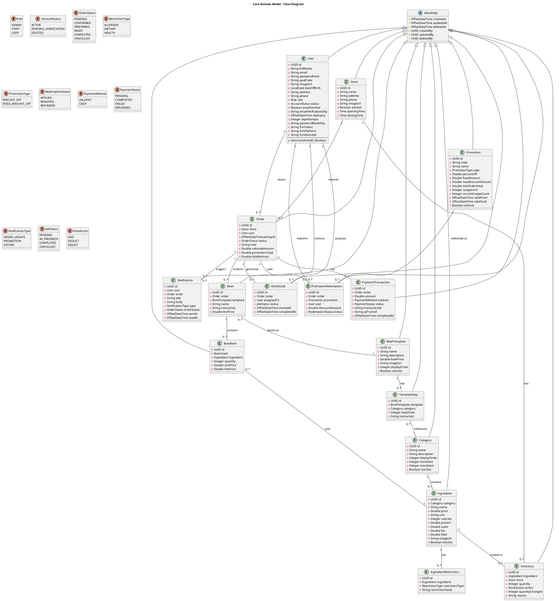

# System Architecture & Class Diagrams

## 1. High-Level System Architecture Diagram

## 2. Core Domain Model Class Diagram

## 3. Service Layer Class Diagram

```plantuml
@startuml
title Service Layer - Class Diagram

interface CrudService<T> {
  + findAll(): List<T>
  + findById(UUID id): Optional<T>
  + create(T entity): T
  + update(UUID id, T entity): T
  + deleteById(UUID id): void
}

interface SoftDeleteService<T> extends CrudService {
  + softDelete(UUID id): void
  + restore(UUID id): T
  + findAllIncludingDeleted(): List<T>
}

class ServiceProvider {
  - UserService userService
  - OrderService orderService
  - BowlService bowlService
  - IngredientService ingredientService
  - AuthService authService
  - PaymentService paymentService
  - FcmService fcmService
  - NotificationService notificationService
  --
  + users(): UserService
  + orders(): OrderService
  + bowls(): BowlService
  + ingredients(): IngredientService
  + auth(): AuthService
  + payments(): PaymentService
  + fcm(): FcmService
  + notifications(): NotificationService
}

class AuthService {
  - UserService userService
  - JwtService jwtService
  - OtpService otpService
  - EmailService emailService
  - TokenService tokenService
  - FcmService fcmService
  --
  + register(RegisterRequest): EmailVerificationResponse
  + login(LoginRequest): LoginResponse
  + logout(String bearerToken): void
  + verifyOtp(VerifyOtpRequest): EmailVerificationResponse
  + resendVerificationOtp(String email): EmailVerificationResponse
  + forgotPassword(ForgotPasswordRequest): void
  + resetPassword(ResetPasswordRequest): void
  + refreshToken(RefreshTokenRequest): LoginResponse
}

class UserService implements SoftDeleteService {
  - UserRepository repository
  --
  + findByEmail(String email): Optional<User>
  + updateProfile(UUID id, UserUpdateRequest): User
  + changePassword(UUID id, String oldPassword, String newPassword): void
  + isAccountActive(User user): Boolean
}

class OrderService implements CrudService {
  - OrderRepository repository
  - BowlService bowlService
  - PromotionService promotionService
  - FcmService fcmService
  - KitchenJobService kitchenJobService
  - InventoryService inventoryService
  --
  + findByUserId(UUID userId): List<Order>
  + recalcTotals(UUID orderId): Order
  + applyPromotion(UUID orderId, String code): Order
  + confirm(UUID orderId): Order
  + cancel(UUID orderId, String reason): Order
  + complete(UUID orderId): Order
  - calculateSubtotal(Order order): Double
  - calculateTotal(Order order): Double
}

class BowlService implements CrudService {
  - BowlRepository repository
  - BowlItemService bowlItemService
  - IngredientService ingredientService
  --
  + createWithItems(BowlRequest): Bowl
  + calculateBowlPrice(Bowl bowl): Double
  + validateIngredientSelection(Bowl bowl): Boolean
}

class IngredientService implements SoftDeleteService {
  - IngredientRepository repository
  - CategoryService categoryService
  --
  + findByCategoryId(UUID categoryId): List<Ingredient>
  + updatePrice(UUID id, Double newPrice): Ingredient
  + checkAvailability(UUID ingredientId): Boolean
}

class PaymentService implements CrudService {
  - PaymentTransactionRepository repository
  - ZaloPayService zaloPayService
  --
  + createPayment(UUID orderId, Double amount): PaymentTransaction
  + updatePaymentStatus(String transactionId, PaymentStatus status): PaymentTransaction
  + initiateRefund(UUID orderId): PaymentTransaction
  + findByOrderId(UUID orderId): List<PaymentTransaction>
}

class FcmService {
  - FirebaseMessaging firebaseMessaging
  - UserRepository userRepository
  - NotificationService notificationService
  --
  + updateFcmToken(UUID userId, String token, String platform, String deviceId): void
  + removeFcmToken(UUID userId): void
  + sendOrderNotification(Order order, OrderStatus status): void
  + sendPromotionalNotification(List<UUID> userIds, PromotionalRequest): void
  - buildNotificationMessage(String token, String title, String body, Map<String,String> data): Message
}

class NotificationService implements CrudService {
  - NotificationRepository repository
  --
  + getUserNotifications(UUID userId, Pageable pageable): Page<Notification>
  + getUnreadCount(UUID userId): Integer
  + markAsRead(UUID notificationId): void
  + markAllAsRead(UUID userId): void
  + saveNotification(NotificationRequest): Notification
}

class ZaloPayService {
  - RestTemplate restTemplate
  - ZaloPayConfig config
  --
  + createOrder(UUID orderId, Double amount): ZaloPayOrderResponse
  + handleCallback(CallbackRequest): CallbackResponse
  + queryOrderStatus(String appTransId): QueryResponse
  - generateMac(String data): String
  - verifyMac(String data, String mac): Boolean
}

class EmailService {
  - JavaMailSender mailSender
  - TemplateEngine templateEngine
  --
  + sendVerificationOtp(String email, String otp): void
  + sendPasswordResetOtp(String email, String otp): void
  - loadTemplate(String templateName, Map<String,Object> variables): String
}

class OtpService {
  + generateOtp(): String
  + validateOtp(String stored, String input, OffsetDateTime expiry): Boolean
  + isExpired(OffsetDateTime expiry): Boolean
}

class JwtService {
  - String secretKey
  - Long accessTokenExpiration
  - Long refreshTokenExpiration
  --
  + generateAccessToken(User user): String
  + generateRefreshToken(User user): String
  + validateToken(String token): Boolean
  + getUserIdFromToken(String token): UUID
  + extractToken(String bearerToken): String
}

class KitchenJobService implements CrudService {
  - KitchenJobRepository repository
  --
  + findPendingJobs(): List<KitchenJob>
  + assignJob(UUID jobId, UUID staffId): KitchenJob
  + updateStatus(UUID jobId, JobStatus status): KitchenJob
  + completeJob(UUID jobId): KitchenJob
}

class InventoryService implements CrudService {
  - InventoryRepository repository
  --
  + checkAvailability(UUID ingredientId, Integer quantity, UUID storeId): Boolean
  + deductStock(UUID ingredientId, Integer quantity, UUID storeId): void
  + addStock(UUID ingredientId, Integer quantity, UUID storeId): void
  + adjustStock(UUID ingredientId, Integer newQuantity, UUID storeId, String reason): void
  + getLowStockItems(UUID storeId): List<Inventory>
}

' Relationships
ServiceProvider --> AuthService
ServiceProvider --> UserService
ServiceProvider --> OrderService
ServiceProvider --> BowlService
ServiceProvider --> IngredientService
ServiceProvider --> PaymentService
ServiceProvider --> FcmService
ServiceProvider --> NotificationService

AuthService --> UserService
AuthService --> JwtService
AuthService --> OtpService
AuthService --> EmailService
AuthService --> FcmService

OrderService --> BowlService
OrderService --> FcmService
OrderService --> KitchenJobService
OrderService --> InventoryService

BowlService --> IngredientService

PaymentService --> ZaloPayService

FcmService --> NotificationService

@enduml
```

## 4. Controller Layer Class Diagram

```plantuml
@startuml
title Controller Layer - Class Diagram

abstract class BaseController<T, TRequest, TResponse> {
  # abstract getService(): CrudService<T>
  # abstract toResponse(T entity): TResponse
  # abstract toEntity(TRequest request): T
  --
  + getAll(): ResponseEntity<ApiResponse<List<TResponse>>>
  + getAllActive(): ResponseEntity<ApiResponse<List<TResponse>>>
  + getAllInactive(): ResponseEntity<ApiResponse<List<TResponse>>>
  + getById(UUID id): ResponseEntity<ApiResponse<TResponse>>
}

class ApiResponse<T> {
  - Integer statusCode
  - String message
  - T data
  - String errorCode
  - OffsetDateTime timestamp
  --
  + static success(Integer code, String message, T data): ApiResponse<T>
  + static error(Integer code, String errorCode, String message): ApiResponse<T>
}

class AuthController {
  - ServiceProvider serviceProvider
  - AuthMapper mapper
  --
  + register(RegisterRequest): ResponseEntity<ApiResponse<EmailVerificationResponse>>
  + login(LoginRequest): ResponseEntity<ApiResponse<LoginResponse>>
  + logout(String bearerToken): ResponseEntity<ApiResponse<Void>>
  + verifyOtp(VerifyOtpRequest): ResponseEntity<ApiResponse<EmailVerificationResponse>>
  + resendVerificationOtp(String email): ResponseEntity<ApiResponse<EmailVerificationResponse>>
  + forgotPassword(ForgotPasswordRequest): ResponseEntity<ApiResponse<Void>>
  + resetPassword(ResetPasswordRequest): ResponseEntity<ApiResponse<Void>>
  + refreshToken(RefreshTokenRequest): ResponseEntity<ApiResponse<LoginResponse>>
}

class UserController extends BaseController {
  - ServiceProvider serviceProvider
  - UserMapper mapper
  --
  + updateProfile(UUID id, UserUpdateRequest): ResponseEntity<ApiResponse<UserResponse>>
  + changePassword(UUID id, ChangePasswordRequest): ResponseEntity<ApiResponse<Void>>
}

class OrderController {
  - ServiceProvider serviceProvider
  - OrderMapper mapper
  --
  + getAll(): ResponseEntity<ApiResponse<List<OrderResponse>>>
  + getById(UUID id): ResponseEntity<ApiResponse<OrderResponse>>
  + create(OrderRequest): ResponseEntity<ApiResponse<OrderResponse>>
  + update(UUID id, OrderRequest): ResponseEntity<ApiResponse<OrderResponse>>
  + delete(UUID id): ResponseEntity<ApiResponse<Void>>
  + recalc(UUID id): ResponseEntity<ApiResponse<OrderResponse>>
  + applyPromo(UUID id, String code): ResponseEntity<ApiResponse<OrderResponse>>
  + confirm(UUID id): ResponseEntity<ApiResponse<OrderResponse>>
  + cancel(UUID id, String reason): ResponseEntity<ApiResponse<OrderResponse>>
  + complete(UUID id): ResponseEntity<ApiResponse<OrderResponse>>
  + updateStatus(UUID orderId, UpdateOrderStatusRequest): ResponseEntity<ApiResponse<OrderResponse>>
  + getByUserId(UUID userId): ResponseEntity<ApiResponse<List<OrderResponse>>>
}

class BowlController {
  - ServiceProvider serviceProvider
  - BowlMapper mapper
  --
  + getAll(): ResponseEntity<ApiResponse<List<BowlResponse>>>
  + getById(UUID id): ResponseEntity<ApiResponse<BowlResponse>>
  + create(BowlRequest): ResponseEntity<ApiResponse<BowlResponse>>
  + update(UUID id, BowlRequest): ResponseEntity<ApiResponse<BowlResponse>>
  + delete(UUID id): ResponseEntity<ApiResponse<Void>>
}

class IngredientController extends BaseController {
  - ServiceProvider serviceProvider
  - IngredientMapper mapper
  --
  + getByCategoryId(UUID categoryId): ResponseEntity<ApiResponse<List<IngredientResponse>>>
  + updatePrice(UUID id, UpdatePriceRequest): ResponseEntity<ApiResponse<IngredientResponse>>
}

class NotificationController {
  - FcmService fcmService
  - NotificationService notificationService
  --
  + saveFcmToken(UUID userId, FcmTokenRequest): ResponseEntity<ApiResponse>
  + removeFcmToken(UUID userId): ResponseEntity<ApiResponse>
  + getUserNotifications(UUID userId, Pageable pageable): ResponseEntity<Page<NotificationResponse>>
  + getUnreadCount(UUID userId): ResponseEntity<ApiResponse<Integer>>
  + markAsRead(UUID userId, UUID notificationId): ResponseEntity<ApiResponse>
  + markAllAsRead(UUID userId): ResponseEntity<ApiResponse>
  + sendPromotionalNotification(PromotionalNotificationRequest): ResponseEntity<ApiResponse>
}

class PaymentTransactionController {
  - ServiceProvider serviceProvider
  - PaymentTransactionMapper mapper
  --
  + getAll(): ResponseEntity<ApiResponse<List<PaymentTransactionResponse>>>
  + getById(UUID id): ResponseEntity<ApiResponse<PaymentTransactionResponse>>
  + create(PaymentTransactionRequest): ResponseEntity<ApiResponse<PaymentTransactionResponse>>
}

class ZaloPayController {
  - ZaloPayService zaloPayService
  --
  + createOrder(ZaloPayCreateOrderRequest): ResponseEntity<ApiResponse<ZaloPayOrderResponse>>
  + handleCallback(Map<String,String> callbackData): ResponseEntity<Map<String,Object>>
  + queryStatus(UUID orderId): ResponseEntity<ApiResponse<QueryResponse>>
}

class KitchenJobController {
  - ServiceProvider serviceProvider
  - KitchenJobMapper mapper
  --
  + getPendingJobs(): ResponseEntity<ApiResponse<List<KitchenJobResponse>>>
  + assignJob(UUID jobId, UUID staffId): ResponseEntity<ApiResponse<KitchenJobResponse>>
  + updateStatus(UUID jobId, UpdateJobStatusRequest): ResponseEntity<ApiResponse<KitchenJobResponse>>
  + completeJob(UUID jobId): ResponseEntity<ApiResponse<KitchenJobResponse>>
}

class InventoryController {
  - ServiceProvider serviceProvider
  - InventoryMapper mapper
  --
  + getByStoreId(UUID storeId): ResponseEntity<ApiResponse<List<InventoryResponse>>>
  + addStock(AddStockRequest): ResponseEntity<ApiResponse<InventoryResponse>>
  + deductStock(DeductStockRequest): ResponseEntity<ApiResponse<Void>>
  + adjustStock(AdjustStockRequest): ResponseEntity<ApiResponse<InventoryResponse>>
  + getLowStock(UUID storeId): ResponseEntity<ApiResponse<List<InventoryResponse>>>
}

' Relationships
AuthController --> ServiceProvider
UserController --> ServiceProvider
OrderController --> ServiceProvider
BowlController --> ServiceProvider
IngredientController --> ServiceProvider
PaymentTransactionController --> ServiceProvider
KitchenJobController --> ServiceProvider
InventoryController --> ServiceProvider

NotificationController --> FcmService
NotificationController --> NotificationService

ZaloPayController --> ZaloPayService

AuthController ..> ApiResponse : uses
UserController ..> ApiResponse : uses
OrderController ..> ApiResponse : uses
BowlController ..> ApiResponse : uses

@enduml
```

